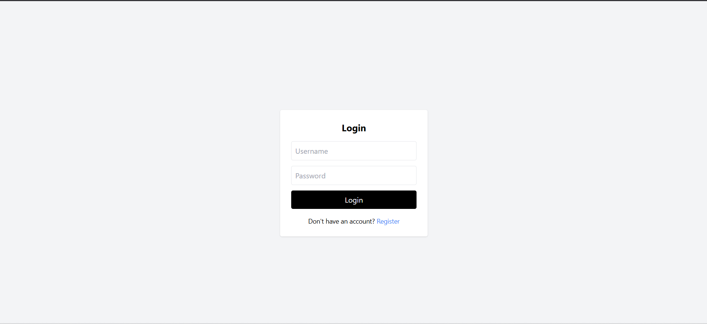
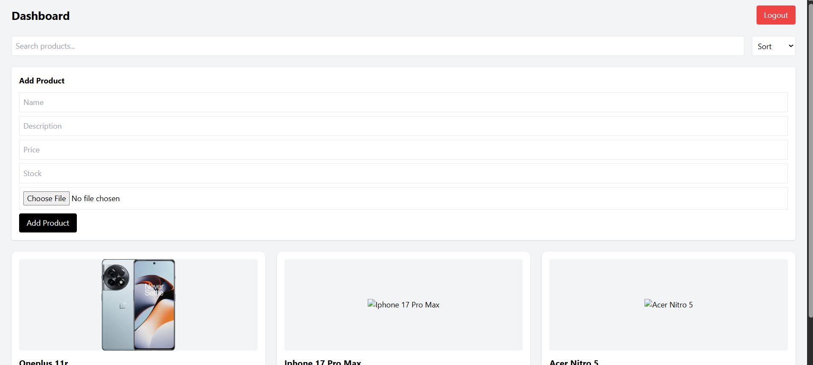
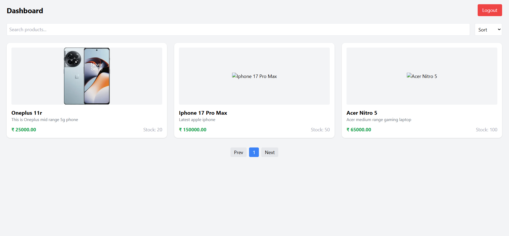

# 🛒  E-Commerce Product Management System

A full-stack **E-Commerce Product Management System** built using **Django REST Framework** and **React.js**, featuring authentication, role-based access control, caching, and optimized API performance.

---

## 🚀 Features

### 🔐 Authentication & Authorization

* JWT-based authentication (Access + Refresh tokens)
* Auto token refresh using Axios interceptors
* Role-based access control (Admin / User)
* Protected routes in React

### 📦 Product Management

* Create, Read, Update, Delete (CRUD) operations
* Image upload support (AWS S3 integration)
* Product validation (price, stock, name)
* Admin-only product management

### 🔍 Advanced Functionality

* Search functionality
* Pagination support
* Sorting (price, newest)
* Debounced search (optimized API calls)

### ⚡ Performance Optimization

* Backend caching using Django cache framework
* Query-based cache keys
* Cache invalidation on data changes

### 🎨 Frontend UI

* Responsive dashboard (React + Tailwind CSS)
* Dynamic product cards
* Image fallback handling
* Loading & error states

---

## 🏗️ Tech Stack

### Backend

* Django
* Django REST Framework
* PostgreSQL
* JWT Authentication (SimpleJWT)
* Django Filters
* AWS S3 (media storage)

### Frontend

* React.js
* Axios
* React Router
* Tailwind CSS
* JWT Decode

---

## 📂 Project Structure

```
backend/
├── accounts/
├── products/
├── config/
└── manage.py

frontend/
├── src/
│   ├── components/
│   ├── pages/
│   ├── api/
│   └── App.jsx
```

---

## ⚙️ Setup Instructions

### 🔧 Backend Setup

```bash
git clone <repo-url>
cd backend

# Create virtual environment
python -m venv env
source env/bin/activate  # Windows: env\Scripts\activate

# Install dependencies
pip install -r requirements.txt

# Run migrations
python manage.py migrate

# Start server
python manage.py runserver
```

---

### 💻 Frontend Setup

```bash
cd frontend

npm install
npm run dev
```

---

## 🔐 API Endpoints

### Auth

* `POST /api/v1/auth/register/`
* `POST /api/v1/auth/login/`
* `POST /api/v1/auth/refresh/`

### Products

* `GET /api/v1/products/`
* `POST /api/v1/products/` (Admin only)
* `PUT /api/v1/products/{id}/` (Admin only)
* `DELETE /api/v1/products/{id}/` (Admin only)

---

## ⚡ Caching Strategy

* Implemented caching for product list & detail APIs
* Cache keys generated using request query parameters
* Cache invalidated on create/update/delete operations
* Improves API response time and reduces database load

---

## 🧠 Key Learnings

* Implemented JWT authentication with refresh flow
* Optimized API calls using debouncing
* Designed scalable backend with caching
* Built role-based access control system
* Integrated cloud storage (AWS S3)

---

## 📸 Screenshots

* Login Page


* Register Page


* Admin Dashboard


* User Dashboard


---

## 🚀 Future Improvements

* Redis caching (production-level)
* Docker & CI/CD pipeline
* Payment gateway integration
* Wishlist & cart system
* Advanced analytics dashboard

---

## 👨‍💻 Author

**Pratul Kumar**

* GitHub: https://github.com/pratul74
* LinkedIn: https://linkedin.com/in/pratul74


